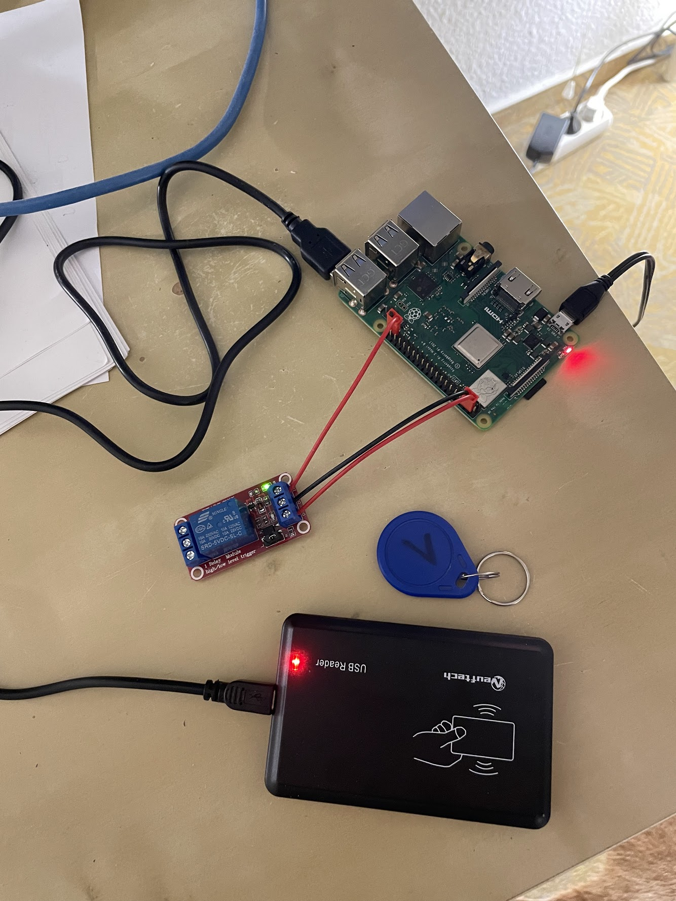

# Fuks Doorman System

The purpose of the Fuks Doorman system is to allow fuks members access to the fuks office
by using RFID tags in student ID cards.

The system is assembled out of a Raspberry Pi, an RFID reader, a relay module and an electronic door opener.
Members can register the RFID number from their KIT-Card at Google Workspace.
The RFID reader placed at the office door can then read these numbers and pass them to the Raspberry Pi.
There the numbers will be checked and authenticated.
If the number can be matched to a fuks user, the door will be opened by using a simple relay and GPIO pins.



## Create new credentials

The Doorman system needs access to Google Workspace APIs to fetch authorized RFID chip-numbers.
To do this a **service account** with **domain-wide delegation** is required.

The domain-wide delegation needs the following OAuth scopes:

```
https://www.googleapis.com/auth/admin.directory.user,
https://www.googleapis.com/auth/admin.directory.userschema,
https://www.googleapis.com/auth/admin.directory.group,
https://www.googleapis.com/auth/admin.directory.group.member,
https://www.googleapis.com/auth/spreadsheets.readonly
````

Follow the
instructions [here](https://developers.google.com/workspace/guides/create-credentials#create_credentials_for_a_service_account)
to create a new credentials.json.
The generated JSON must be placed under ```fuks/credentials.json``` and will be included in the compiled GO executable.

> Note that you might need to update the email address field **config.Subject** in ```fuks/fuks.go```

## Compile and install Doorman CLI

```shell
go get all

go install cmd/doorman/doorman.go
go install cmd/rfid/doorman_rfid.go
go install cmd/door/door.go
```

> Note: Add ```export PATH=$PATH:$HOME/go/bin/``` to ```.bashrc```

## Create doorman service

```shell
sudo mkdir -p /etc/doorman/
sudo cp config.json /etc/doorman/config.json
sudo cp fallback_access.json /etc/doorman/fallback-access.json

sudo cp doorman.service /etc/systemd/system/
sudo systemctl daemon-reload
sudo service doorman start
```

Run ```sudo systemctl enable doorman``` to start the doorman service on startup

## Troubleshooting

```shell
# View logs
cat /var/log/doorman.log
# Find Raspberry Pi
sudo nmap -PE 10.0.0.0/24
```

## Cross compile executables

```shell
rm -rf bin
mkdir -p bin
GOOS=linux GOARCH=arm go build -o bin/doorman cmd/doorman/doorman.go
GOOS=linux GOARCH=arm go build -o bin/rfid cmd/rfid/rfid.go
GOOS=linux GOARCH=arm go build -o bin/door cmd/door/door.go
```
